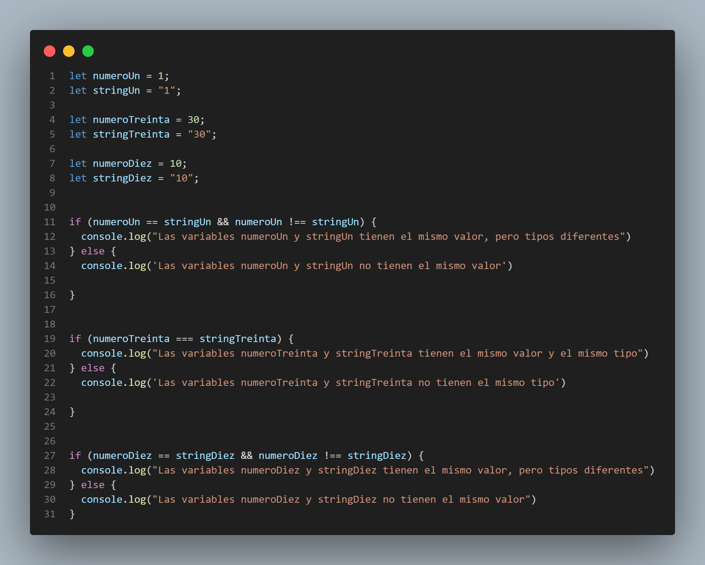

# **#7DaysOfCode**

## 📄 Descripción

Este repositorio alberga las soluciones a los desafíos diarios de lógica de programación del reto #7DaysOfCode de Alura Latam. Durante 7 días, me dedico a mejorar mis habilidades en programación y lógica resolviendo problemas diseñados para desafiar mi capacidad de pensamiento crítico y resolución eficiente.

## 💻 Tecnologías Usadas

-  **HTML**
-  **CSS**
-  **JavaScript**

## 📂 Enlaces a los Desafíos

- [Día 1](https://app.rdstation.email/mail/d52c9c18-1e5b-4f7b-833b-b629b5074336?utm_campaign=al_7_days_logica_javascript_-_dia_1&utm_medium=email&utm_source=RD+Station)
- [Día 2](https://app.rdstation.email/mail/5f541ce4-b6b6-47e8-b0dc-3bc2505046ad?utm_campaign=al_7_days_logica_javascript_-_dia_2&utm_medium=email&utm_source=RD+Station)
- [Día 3](https://app.rdstation.email/mail/c6cbbe9c-5faa-4c01-8ef5-6cb9248c9973?utm_campaign=al_7_days_logica_javascript_-_dia_3&utm_medium=email&utm_source=RD+Station)
- [Día 4](https://app.rdstation.email/mail/2cabf4d6-1721-4f5b-8d64-2566fa6f20c3?utm_campaign=al_7_days_logica_javascript_-_dia_4&utm_medium=email&utm_source=RD+Station)
- [Día 5](https://app.rdstation.email/mail/d90cb762-b65e-43f7-889a-de31eb98b5a5?utm_campaign=al_7_days_logica_javascript_-_dia_5&utm_medium=email&utm_source=RD+Station)
- [Día 6](https://app.rdstation.email/mail/db912cb5-ad67-4761-89a1-a1142bbe00cd?utm_campaign=al_7_days_logica_javascript_-_dia_6&utm_medium=email&utm_source=RD+Station)
- [Día 7](https://app.rdstation.email/mail/fd2d7393-32e0-4938-b8ef-6337188e150b?utm_campaign=al_7_days_logica_javascript_-_dia_7&utm_medium=email&utm_source=RD+Station)

## 📸 Ejemplos

Aquí puedes ver algunos ejemplos de los desafíos resueltos.

## 👨‍💻 Autor: 

